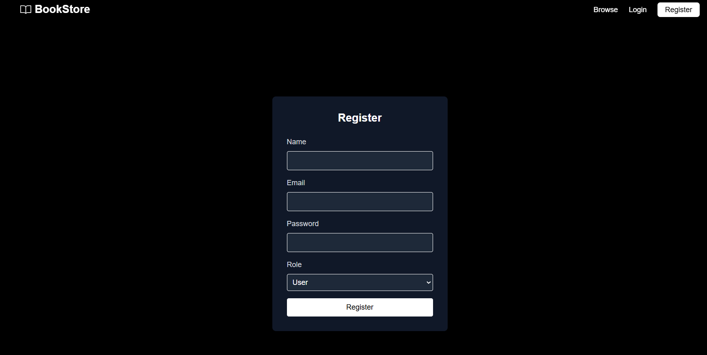
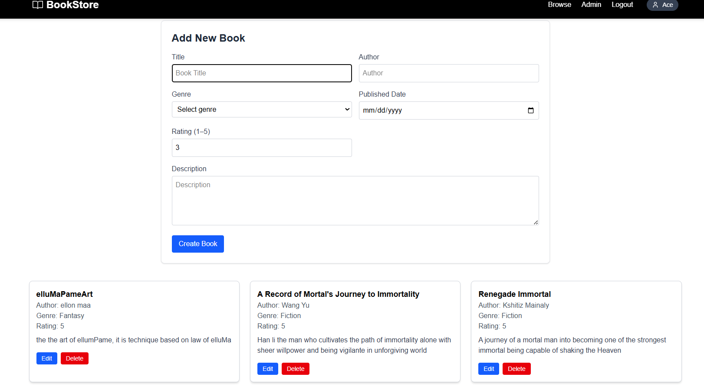
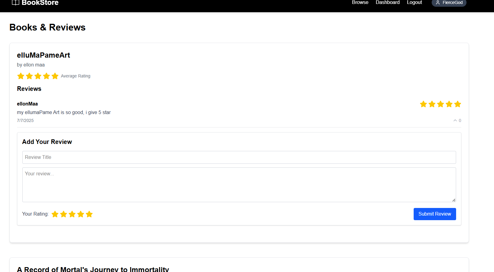
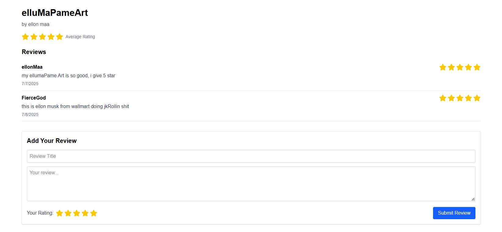

# 📚 MERN Book Review App

A full-stack MERN application for managing books, reviews, user authentication, and admin controls 

## 🚀 Live Demo

👉 [Live Frontend](https://book-management-api-tau.vercel.app/)  
👉 [Backend API](https://book-management-api-gmse.onrender.com/api/v1/books)

---
## 📸 Screenshots

- **Landing Page**
  

- **Register Page**
  

- **AdminDashboarb Page**
  

- **UserDashboarb Page**
  

- **Review Page**
  

## 🚀 Features

- 🔒 **Authentication** — Register, login, JWT protected routes.
- 🗂️ **Admin Panel** — Create, update, delete books.
- ⭐ **Reviews** — Users can add ratings & comments, average rating calculated automatically.
- 📚 **Book Search & Filter** — Search by title or author, filter by genre.
- ✅ **Validation** — Both backend (Mongoose) and frontend checks.
- 🎉 **Notifications** — Toast feedback for success & errors.
- 📦 **REST API** — Well-structured controllers, routes, and models.
- 🖥️ **Responsive UI** — Built with Tailwind CSS.

---

## 🛠️ Tech Stack

- **Frontend:** React, Context API, React Router, Axios, Toastify.
- **Backend:** Node.js, Express, Mongoose, MongoDB.
- **Database:** MongoDB (local when in development or Atlas in deployment).
- **Auth:** JWT, bcrypt.
- **Dev Tools:** Nodemon, dotenv, ESLint, Prettier.

## ⚙️ Installation

1️⃣ Clone the repo  
\`bash
git clone <your-repo-url>
cd your-project
\`

2️⃣ Install dependencies  
# Backend
cd backend
npm install

# Frontend
cd ../frontend
npm install

3️⃣ Create .env files  
- backend/.env:
  \`
  PORT=5000
  MONGO_URI=<your-local-or-atlas-uri>
  JWT_SECRET=your_secret
  JWT_EXPIRE=30d
  \`

- frontend/.env (if needed for proxy):
  VITE_API_URL=http://localhost:5000/api/v1
  VITE_APP_AUTH_TOKEN:your_token

4️⃣ Run development  
# In backend
npm run dev

# In frontend
npm run dev

## ✅ Author

**Built by kshitiz Mainaly ** — powered by 🍃 **MongoDB**, ⚛️ **React**, 🧩 **Node**, 🚂 **Express**.

